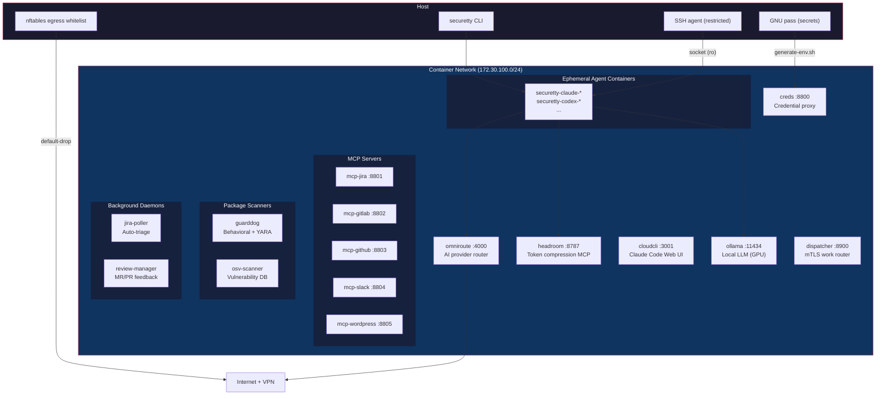
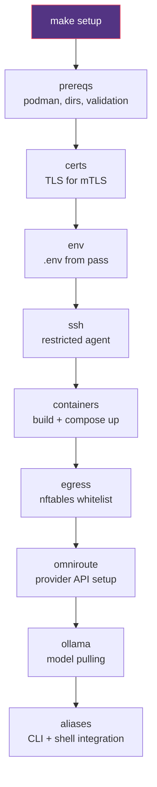

# securetty

Sandboxed AI development environment. All AI CLI agents run inside ephemeral rootless podman containers with credential isolation, egress filtering, delayed package ingestion, and nftables-enforced network policy. Fully declarative via Ansible.

## Architecture



## Security Model

### Credential Isolation

Secrets live in GNU pass on the host. `generate-env.sh` resolves them at container start into per-service `.env` files. Agent containers receive only `OMNIROUTE_API_KEY` — never raw provider keys. The credential proxy (`securetty-creds`) brokers access to everything else.

### Egress Filtering

Default-drop nftables policy in the rootless network namespace. Only resolved IPs from approved domains pass. Domain whitelist is in `group_vars/all.yml` (`securetty_allowed_domains`). Covers AI providers, git hosts, package registries, and configured services.

### Container Hardening

Every agent container runs with:
- `--cap-drop ALL` — no Linux capabilities
- `--security-opt no-new-privileges:true` — no privilege escalation
- `--read-only` — immutable root filesystem
- `--pids-limit 4096` — fork bomb protection
- `--userns=keep-id` — rootless user namespace
- Masked proc/sys paths — no host information leakage
- Named volumes for caches only — code is bind-mounted

### SSH

Dedicated ssh-agent on host with only one key loaded (configurable via `securetty_ssh_key`). Socket forwarded read-only. Private key never enters container.

### Delayed Ingestion

AI agents installed from package versions published >= 7 days ago (configurable via `securetty_quarantine_days`). npm: queries `npm view <pkg> time` for version dates. pip: uses `uv --exclude-newer`. GuardDog and OSV-Scanner continuously scan cached packages for malicious behavior and known vulnerabilities.

### DNS

Aardvark DNS resolves container names on the bridge network and forwards external queries to host DNS (169.254.1.1, patched from Google DNS to avoid VPN leaks). VPN domains resolve automatically.

## Quick Start

```bash
# Prerequisites: podman, podman-compose, ansible, pass (GNU password manager)

# Full setup — builds images, configures services, installs CLI + aliases
make setup

# Launch an agent
securetty run claude ~/src/myproject        # Personal mode (OmniRoute)
securetty run-work claude ~/src/myproject   # Work mode (Vertex AI)

# Or use shell aliases
claude ~/src/myproject
claude-work ~/src/myproject
```

## CLI Reference

```
Usage: securetty <command> [options]

Agent commands:
  run <agent> [options] [args]      Launch agent in personal mode
  run-work <agent> [options] [args] Launch agent in work mode (Vertex AI)
  shell [dir]                       Interactive shell in container
  connect [<container>]             Reattach to running agent container
  code-review <PR-URL>              Review a PR/MR via agent

Agent options:
  --read                            Read-only mode (blocks writes)
  --max-turns N                     Limit agent to N turns
  --timeout T                       Kill session after T (e.g. 30m, 1h, 90s)
  -p, --prompt <text>               Non-interactive prompt (no TTY)
  --cleanup keep|remove             Container lifecycle (default: remove)
  --image <ref>                     Override container image
  -v <host:container>               Extra volume mount (repeatable)

Lifecycle:
  setup [--ide cursor|vscode]       Full setup or generate IDE devcontainer
  build                             Build container images (skip if exist)
  rebuild                           Full rebuild (all image layers)
  rebuild-agents                    Rebuild dev image only (fast)
  up / down / restart               Start / stop / restart services
  nuke                              Remove containers + volumes (destructive)
  update [release|rc|latest]        Update securetty (channel-based)
  rollback --list|--set <tag>       Version management

Configuration:
  config list|get|set|unset         Runtime configuration management
  config profile <name>             Switch named profile
  check [--fix] [--ai]              Health check with auto-repair
  egress                            Reload nftables egress rules + DNS patch
  env                               Regenerate .env files from pass store

Monitoring:
  status                            Dashboard — containers, network, egress, scanners
  list [--all] [--json]             List securetty containers
  top [--live]                      Container resource usage
  scan [alerts|logs]                Package scanner results (GuardDog + OSV)
  volumes                           Show volume sizes
  preflight                         Check prerequisites
  cost [today|week|all]             Session usage tracking
  clean [--yes]                     Remove orphaned containers + stale files
  logs <service> [--follow]         Show container logs
  exec <container> <cmd>            Run command in container
  version                           Show CLI and image version info

Orchestration:
  dispatch <work-item>              Route work item to agent via dispatcher
  jobs [status]                     List dispatched jobs
  watch <repo>|--list|--delete      Manage polling triggers for repo events
  daemon start|stop|status          Background agent daemon
  dashboard [--once|--json]         Real-time TUI dashboard
  alerts --check|--notify           SLI alerting
  jira-triage start|stop|run        Jira auto-triage poller
  review-manager start|stop         MR/PR review feedback manager

Analysis:
  retro [--json] [--since]          Retrospective failure analysis
  confidence --score|--report       Agent confidence scoring
  eval run|list|report              Run promptfoo evaluation suite
  skill list|search|install         Skill marketplace management
  skill run <name> <URL>            Run skill against PR/MR/repo URL
  init <project-dir>                Bootstrap securetty in a new project

Project management:
  group <repo> [ls|status|add|clean]  Git worktree management
  cursor [<path>]                   Launch Cursor with devcontainer
  plugin list|install|remove|update Plugin management

Security:
  scan [alerts|logs]                Package scanner results (GuardDog + OSV)
  audit                             Run npm audit + pip-audit inside container
  test                              Run shellcheck, yamllint, ansible-lint
  migrate                           Remove AI agents from host (destructive)
```

> **Note:** All commands go through `securetty`. The Makefile targets (`make setup`, `make rebuild`, etc.) are thin wrappers that call the same ansible playbooks. Use `securetty` as the single CLI interface.

## Two Modes

| Mode | CLI | Alias | Provider | Use case |
|------|-----|-------|----------|----------|
| Personal | `securetty run <agent>` | `claude`, `c` | OmniRoute (auto-routes) | Personal projects |
| Work | `securetty run-work <agent>` | `claude-work`, `cw` | Google Vertex AI | Work projects |

## Agents

| Agent | Package | Alias | Short | Type |
|-------|---------|-------|-------|------|
| claude | `@anthropic-ai/claude-code` | `claude` / `claude-work` | `c` / `cw` | npm |
| codex | `@openai/codex` | `codex` / `codex-work` | `cx` / `cxw` | npm |
| gemini | `@anthropic-ai/claude-code` | `gemini` / `gemini-work` | `gm` / `gmw` | npm |
| cline | `cline` | `cline` / `cline-work` | `cl` / `clw` | npm |
| opencode | `opencode` | `opencode` / `opencode-work` | `ocd` / `ocdw` | npm |
| aider | `aider-chat` | `aider` / `aider-work` | `ai` / `aiw` | pip |
| goose | `goose-ai` | `goose` / `goose-work` | `gs` / `gsw` | pip |
| grok | `grok-build` | `grok` / `grok-work` | `gr` / `grw` | npm |
| forge | `@anthropic-ai/claude-code` | `forge` / `forge-work` | `fg` / `fgw` | npm |
| kiro-cli | `kiro` | `kiro-cli` / `kiro-work` | `ki` / `kiw` | npm |
| pi-ai | `pi-ai` | `pi-ai` / `pi-ai-work` | `pi` / `piw` | npm |
| kimi | `kimi-cli` | `kimi` / `kimi-work` | `km` / `kmw` | npm |
| jcode | `jcode` | `jcode` / `jcode-work` | `jc` / `jcw` | npm |
| ampcode | `ampcode` | `amp` / `amp-work` | — | npm |
| cursor | — | `cursor` / `cursor-work` | `cr` / `crw` | binary |

All agents run with skip-permissions flags. The container is the sandbox.

## Services

| Container | Purpose | Port |
|-----------|---------|------|
| `securetty-omniroute` | AI provider router + dashboard | 4000 |
| `securetty-headroom` | Token compression MCP server | 8787 |
| `securetty-cloudcli` | Claude Code Web UI | 3001 |
| `securetty-ollama` | Local LLM server (GPU passthrough) | 11434 |
| `securetty-creds` | Credential proxy | 8800 |
| `securetty-dispatcher` | mTLS work item router (DAG workflows) | 8900 |
| `securetty-mcp-jira` | Jira MCP server | 8801 |
| `securetty-mcp-gitlab` | GitLab MCP server | 8802 |
| `securetty-mcp-github` | GitHub MCP server | 8803 |
| `securetty-mcp-slack` | Slack MCP server | 8804 |
| `securetty-mcp-wordpress` | WordPress MCP server | 8805 |
| `securetty-guarddog` | Behavioral + YARA package scanner | — |
| `securetty-osv-scanner` | OSV vulnerability scanner | — |
| `securetty-jira-poller` | Jira auto-triage daemon | — |
| `securetty-review-manager` | MR/PR review feedback daemon | — |
| `securetty-podman-proxy` | Container metrics exporter | 9402 |

## OmniRoute Providers

Configured via `securetty_providers` in `group_vars/all.yml`:

| Provider | Model | Priority |
|----------|-------|----------|
| OpenAI | gpt-4o | 100 |
| Google AI Studio | gemini-2.5-flash | 100 |
| Mistral | mistral-large-latest | 100 |
| OpenRouter | (routing) | 50 |
| Groq | llama-3.3-70b-versatile | 50 |
| Cerebras | — | 50 |
| SambaNova | — | 50 |
| Ollama (local) | (configurable) | 1 (fallback) |

Dashboard: http://localhost:4000

## Image Layers

Three container image layers, each building on the previous:

1. **base** — Fedora 45 minimal with system packages (dnf)
2. **devbase** — Development tools, compilers, language runtimes, pip/npm tooling
3. **dev** — AI agents installed via delayed ingestion (7-day quarantine), user account matching host UID/GID

## Makefile Targets

| Target | Description |
|--------|-------------|
| `make setup` | Full setup (all roles) |
| `make build` | Build container images (skips if exist) |
| `make rebuild` | Force rebuild all images |
| `make rebuild-agents` | Rebuild dev layer only (fast iteration) |
| `make up` | Start services |
| `make down` | Stop all containers |
| `make env` | Regenerate .env files from pass store |
| `make aliases` | Install shell aliases + CLI |
| `make egress` | Resolve domains and load nftables whitelist |
| `make omniroute` | Configure AI providers via REST API |
| `make ollama` | Pull local LLM models |
| `make certs` | Generate TLS certificates for mTLS |
| `make scan` | Scan history for leaked secrets |
| `make migrate` | Remove AI agents from host (destructive) |
| `make nuke` | Remove containers + volumes |
| `make status` | Show container status |
| `make eval` | Run promptfoo evaluation suite |
| `make lint` | Lint configuration |
| `make audit` | Security audit |

## Ansible Roles



| Role | Purpose | Tag |
|------|---------|-----|
| `prereqs` | Install podman, create dirs, auto-detect UID/GID, validate SSH key + pass entries | `prereqs` |
| `certs` | Generate CA and service TLS certificates for mTLS | `certs` |
| `env` | Generate per-service `.env` files from GNU pass | `env` |
| `ssh` | Restricted SSH agent (single key) | `ssh` |
| `containers` | Template Containerfiles + compose, build images, start services | `containers`, `build`, `up` |
| `egress` | Resolve allowed domains and load nftables whitelist | `egress` |
| `omniroute` | Configure AI providers via REST API | `omniroute` |
| `ollama` | Pull local LLM models | `ollama` |
| `aliases` | Template and install securetty CLI + shell aliases | `aliases` |
| `scan` | Scan AI conversation history for leaked secrets | `scan` |
| `migrate` | Remove AI agents from host (destructive, `never` tag) | `migrate` |

## Configuration

All configuration lives in `group_vars/all.yml`:

| Section | What it controls |
|---------|-----------------|
| User/paths | Username, home dir, SSH key name (UID/GID auto-detected) |
| Providers | OmniRoute provider list + priorities |
| API keys | GNU pass paths for each key (`securetty_pass_keys`) |
| Agents | npm/pip/binary packages, alias config, skip-flags |
| Allowed domains | Egress whitelist for nftables |
| Ollama | Models to pull |
| Resources | CPU/memory limits per container |
| Packages | dnf + pip packages for dev container |
| MCP servers | Jira, GitLab, GitHub, Slack, WordPress config |

## Common Changes

- **Add a new AI agent:** Edit `group_vars/all.yml` — add to `securetty_npm_agents`, `securetty_pip_agents`, or `securetty_binary_agents`. Add alias entry to `securetty_agents`. Run `securetty rebuild-agents`.
- **Add a new AI provider:** Store API key in pass, add entry to `securetty_pass_keys` and `securetty_providers` in `group_vars/all.yml`. Run `securetty setup`.
- **Add an egress domain:** Add to `securetty_allowed_domains` in `group_vars/all.yml`. Run `securetty egress`.
- **Add a pip/npm package:** Add to `securetty_pip_tools` or `securetty_npm_tools` in `group_vars/all.yml`. Run `securetty rebuild-agents`.

## Design Documents

| Document | Description |
|----------|-------------|
| [THREAT_MODEL.md](THREAT_MODEL.md) | 8-section threat assessment |
| [docs/security-tiers.md](docs/security-tiers.md) | Graduated 3-tier isolation model + enforcement status |
| [docs/trust-model.md](docs/trust-model.md) | Trusted/untrusted input boundaries |
| [docs/escalation-gates.md](docs/escalation-gates.md) | Confidence gates and risk classification |
| [docs/confidence-scoring.md](docs/confidence-scoring.md) | Learned escalation model |
| [docs/observability.md](docs/observability.md) | Prometheus metrics and OTEL tracing |
| [docs/sli-dashboard.md](docs/sli-dashboard.md) | Real-time dashboard and SLI alerting |
| [docs/evaluation-framework.md](docs/evaluation-framework.md) | promptfoo eval harness |
| [docs/jira-auto-triage.md](docs/jira-auto-triage.md) | Jira auto-triage agent |
| [docs/closed-loop-remediation.md](docs/closed-loop-remediation.md) | Automated SKILL.md fixes |
| [docs/skill-marketplace.md](docs/skill-marketplace.md) | Skill management and sharing |
| [docs/daemon-mode.md](docs/daemon-mode.md) | Background agent daemon |
| [docs/provenance.md](docs/provenance.md) | Agent action provenance |
| [docs/sigstore-verification.md](docs/sigstore-verification.md) | Supply chain verification |

## License

See [LICENSE](LICENSE).
