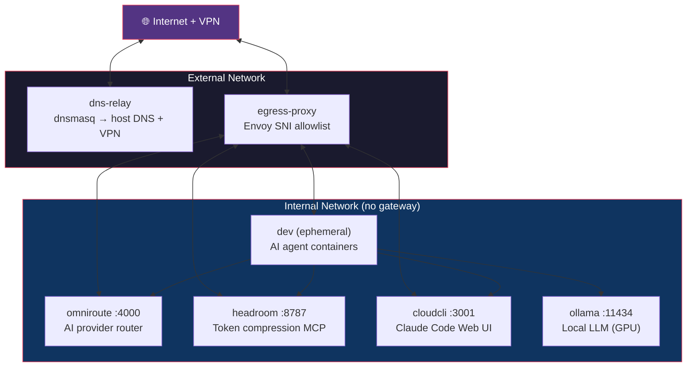
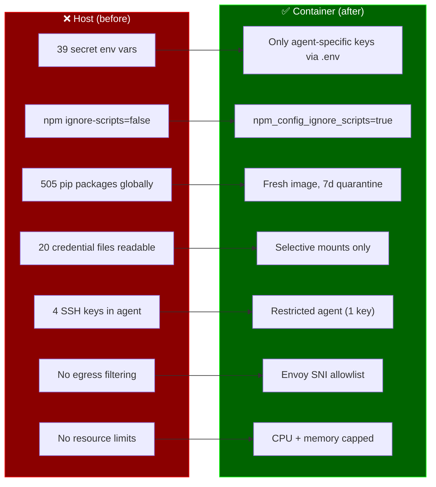
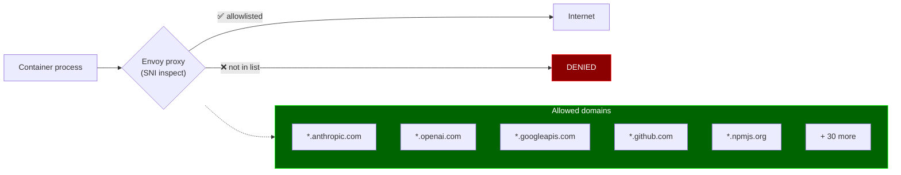
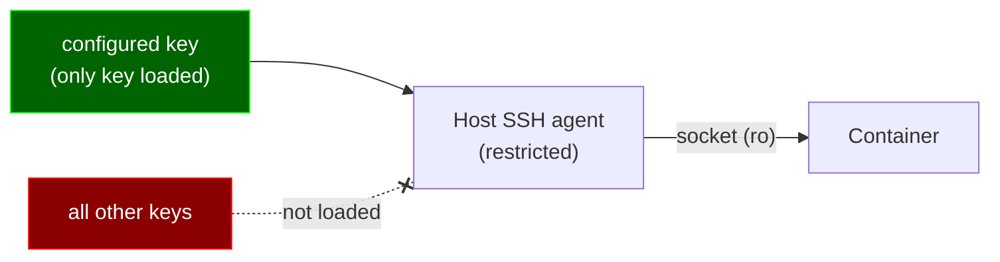
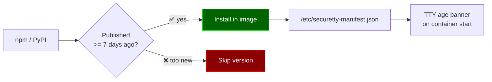
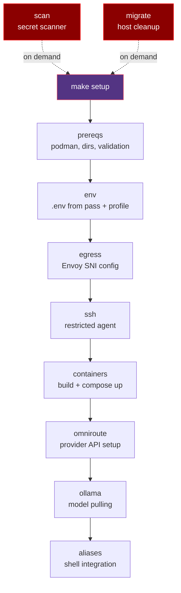

# securetty

Sandboxed AI development environment. All AI CLI agents run inside ephemeral containers with egress filtering, credential isolation, and delayed package ingestion. Fully declarative via Ansible.

## Architecture



## Security Model



### Egress Policy



All containers on `internal` network — no direct internet gateway. Traffic routes through Envoy on `external` network. Only allowlisted domains pass (SNI inspection for TLS, HTTP CONNECT for proxied traffic). Malicious postinstall scripts cannot exfiltrate.

### SSH



Dedicated ssh-agent on host with only one key loaded (configurable via `securetty_ssh_key`). Socket forwarded read-only. Private key never enters container.

### Delayed Ingestion



AI agents installed from versions published >= 7 days ago (configurable via `securetty_quarantine_days`). npm: queries `npm view <pkg> time` for version dates. pip: uses `uv --exclude-newer`.

### DNS

VPN, home, and fallback DNS servers are auto-detected at runtime from `resolvectl` and `/etc/resolv.conf`. No hardcoded IPs — works across any network/location.

## Two Modes

| Mode | Command | Provider | Use case |
|------|---------|----------|----------|
| Personal | `claude`, `c` | OmniRoute (auto-routes to best provider) | Personal projects |
| Work | `claude-work`, `cw` | Google Vertex AI (GCP) | Red Hat work |

All agents run with skip-permissions flags by default (sandbox is the container itself).

## Quick Start

```bash
# Prerequisites: podman, podman-compose, ansible, pass (GNU password manager)

# Full setup — builds, configures, installs aliases
make setup

# Or step by step
make build          # Build container images
make up             # Start services
make omniroute      # Configure providers
make aliases        # Install shell aliases

# Use
claude ~/src/myproject      # Personal mode (omniroute)
claude-work ~/src/myproject # Work mode (Vertex AI)
codex "fix tests"           # Codex via omniroute
gemini-work                 # Gemini via Vertex
```

## Commands

All commands are thin wrappers around `ansible-playbook site.yml --tags <tag>`.

| Command | Description |
|---------|-------------|
| `make setup` | Full setup (all roles) |
| `make build` | Build container images |
| `make up` | Start services |
| `make env` | Regenerate .env files |
| `make aliases` | Install shell aliases |
| `make omniroute` | Configure omniroute providers |
| `make ollama` | Pull ollama models |
| `make scan` | Scan history for leaked secrets |
| `make migrate` | Remove AI agents from host |
| `make down` | Stop all containers |
| `make nuke` | Remove containers + volumes |
| `make status` | Show container status |

### Shell Aliases

| Personal | Work | Short | Short-work | Agent |
|----------|------|-------|------------|-------|
| `claude` | `claude-work` | `c` | `cw` | Claude Code |
| `codex` | `codex-work` | `cx` | `cxw` | Codex CLI |
| `gemini` | `gemini-work` | `gm` | `gmw` | Gemini CLI |
| `cursor` | `cursor-work` | `cr` | `crw` | Cursor CLI |
| `cline` | `cline-work` | `cl` | `clw` | Cline |
| `opencode` | `opencode-work` | `oc` | `ocw` | OpenCode |
| `aider` | `aider-work` | `ai` | `aiw` | Aider |
| `openhands` | `openhands-work` | `oh` | `ohw` | OpenHands |
| `goose` | `goose-work` | `gs` | `gsw` | Goose |
| `grok` | `grok-work` | `gr` | `grw` | Grok Build |
| `forge` | `forge-work` | `fg` | `fgw` | Forge |
| `kiro-cli` | `kiro-work` | `ki` | `kiw` | Kiro CLI |
| `pi-ai` | `pi-ai-work` | `pi` | `piw` | Pi AI |
| `kimi` | `kimi-work` | `km` | `kmw` | Kimi CLI |

## Containers

| Container | Image | Purpose | Ports |
|-----------|-------|---------|-------|
| `securetty-dns-relay` | dnsmasq | DNS forwarding (VPN + public) | 53 (internal) |
| `securetty-egress-proxy` | Envoy | SNI-filtered egress allowlist | 443, 3128, 22 (internal) |
| `securetty-omniroute` | omniroute | AI provider router | 4000 (host 127.0.0.1) |
| `securetty-headroom` | headroom | Token compression MCP | 8787 (internal) |
| `securetty-cloudcli` | cloudcli | Claude Code Web UI | 3001 (host 127.0.0.1) |
| `securetty-ollama` | ollama | Local LLM server (GPU) | 11434 (host 127.0.0.1) |
| `securetty` | dev | Persistent dev shell (optional) | — |
| `securetty-<agent>-*` | dev | Ephemeral agent containers | — |

## OmniRoute Providers

Configured via `securetty_providers` in `group_vars/all.yml`. Default setup:

| Provider | Priority | Type |
|----------|----------|------|
| OpenAI | 100 | Paid |
| Google AI Studio | 100 | Paid |
| Mistral | 100 | Paid |
| OpenRouter | 50 | Free tier |
| Groq | 50 | Free tier |
| Cerebras | 50 | Free tier |
| SambaNova | 50 | Free tier |
| Ollama (local) | 1 | Fallback |

Dashboard: http://localhost:4000

## Ansible Roles



| Role | Purpose | Tag |
|------|---------|-----|
| `prereqs` | Install podman, create dirs, auto-detect DNS + UID/GID, validate SSH key + pass entries | `prereqs` |
| `env` | Generate `.env` files from GNU pass + shell profile | `env` |
| `egress` | Template Envoy SNI allowlist config | `egress` |
| `ssh` | Restricted SSH agent (single key) | `ssh` |
| `containers` | Template Containerfiles + compose, build images, start services | `containers`, `build`, `up` |
| `omniroute` | Configure AI providers via REST API | `omniroute` |
| `ollama` | Pull local LLM models | `ollama` |
| `aliases` | Template and install shell aliases | `aliases` |
| `scan` | Scan AI conversation history for leaked secrets | `scan` |
| `migrate` | Remove AI agents from host (destructive, `never` tag) | `migrate` |

## File Structure

```
securetty/
├── ansible.cfg                    # Ansible config
├── inventory.yml                  # Localhost
├── site.yml                       # Main playbook (10 roles)
├── Makefile                       # Thin wrappers
├── group_vars/
│   └── all.yml                    # All configuration
├── roles/
│   ├── prereqs/tasks/             # System deps, DNS auto-detect
│   ├── env/
│   │   ├── tasks/
│   │   └── templates/generate-env.sh.j2
│   ├── containers/
│   │   ├── tasks/
│   │   ├── templates/             # 7 Containerfile.*.j2 + compose + dnsmasq
│   │   └── files/                 # entrypoint.sh, install-delayed.sh, xdg-open
│   ├── egress/
│   │   ├── tasks/
│   │   └── templates/envoy.yaml.j2
│   ├── ssh/
│   │   ├── tasks/
│   │   └── templates/ssh-agent-restricted.sh.j2
│   ├── omniroute/tasks/           # Provider setup via API
│   ├── ollama/tasks/              # Model pulling
│   ├── aliases/
│   │   ├── tasks/
│   │   └── templates/securetty-aliases.sh.j2
│   ├── scan/
│   │   ├── tasks/
│   │   └── files/scan-secrets.sh
│   └── migrate/tasks/             # Host agent removal
├── LICENSE
├── README.md
└── version
```

## Configuration

All configuration lives in `group_vars/all.yml`. Key sections:

| Section | What it controls |
|---------|-----------------|
| User/paths | Username, home dir, SSH key name (UID/GID auto-detected) |
| Network | Internal subnet (DNS + UID/GID auto-detected at runtime) |
| Providers | OmniRoute provider list + priorities |
| API keys | GNU pass paths for each key |
| Agents | npm/pip packages, alias config, skip-flags |
| Ollama | Models to pull |
| Egress | Domain allowlist for Envoy SNI filter |
| Resources | CPU/memory limits per container |
| Packages | dnf + pip packages for dev container |
| Migration | Packages/binaries/services to remove from host |

## Adding a New AI Agent

1. Add to `group_vars/all.yml`:
   - `securetty_npm_agents` or `securetty_pip_agents` (package name)
   - `securetty_agents` (alias config: name, skip flag, short alias, work mode)
   - `securetty_allowed_domains` (provider API domains)
   - `securetty_pass_keys` (API key pass path, if needed)
2. Add `_lazy_pass` to `~/.bashrc.d/scripts.d/13-free-ai-providers.sh`
3. `make setup`

## Adding a New Provider to OmniRoute

1. Get API key, store: `pass insert <provider>/key`
2. Add to `group_vars/all.yml`:
   - `securetty_providers` (id, name, key_var, priority)
   - `securetty_pass_keys` (var, path)
3. Add `_lazy_pass` to `~/.bashrc.d/scripts.d/13-free-ai-providers.sh`
4. `make omniroute`

## License

See [LICENSE](LICENSE).
